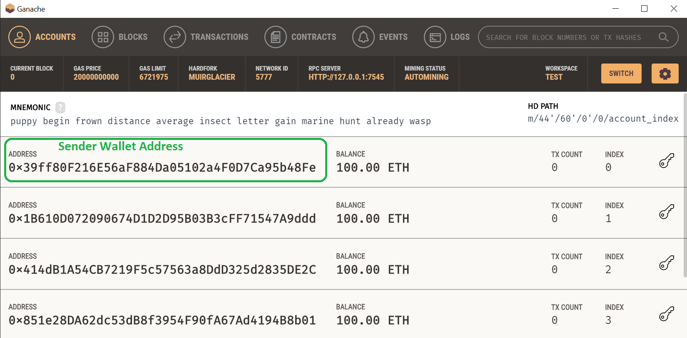
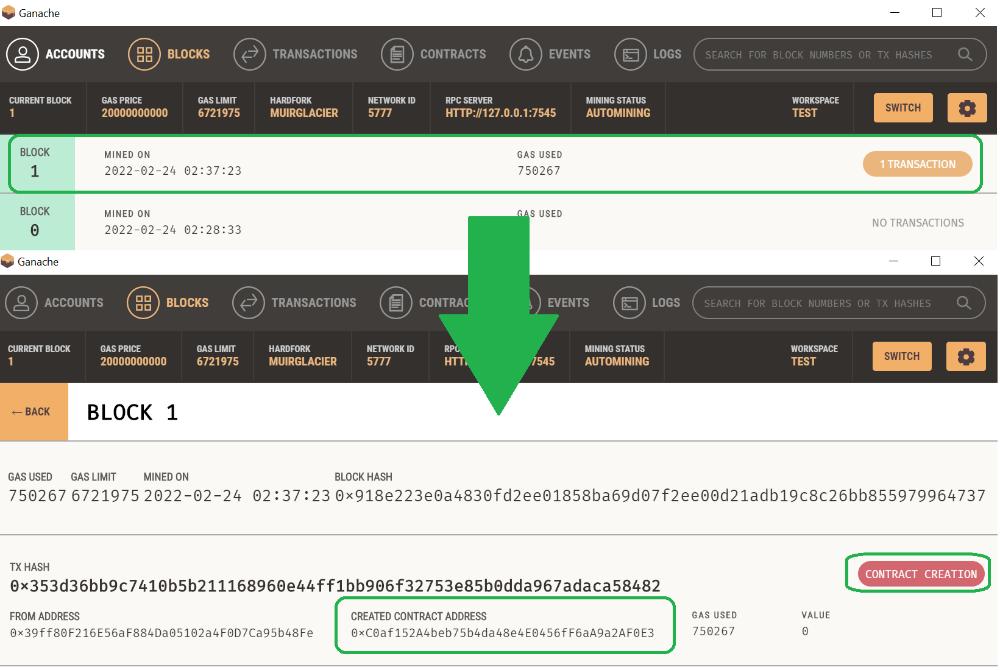
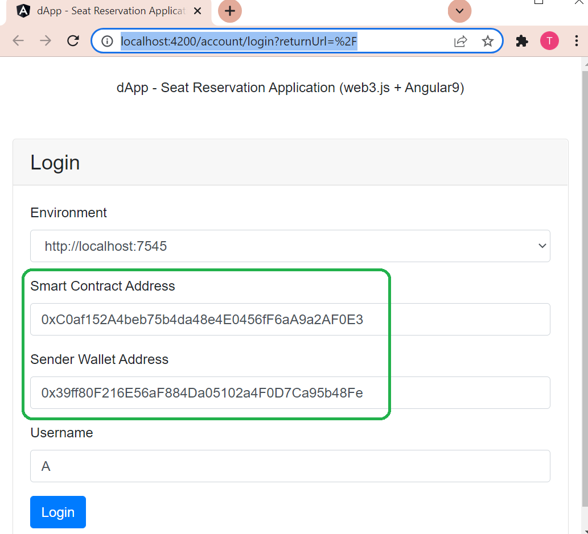

# Seat Reservation
This is an example for dApp - Seat Reservation Application (web3.js + Angular9)

## Slides for Knowledge
1. Blockchain and BitCoin -> https://docs.google.com/presentation/d/1YJm7qluKNDMUy_y7GEQftl6JwpEjFizGW1h3Y1HUY9M/edit?usp=sharing
2. Ethereum and How to develop dApp -> https://docs.google.com/presentation/d/15Ab0C5xTfsyWQXTEJCmU_Z8Bvh7_dwHbXk7DapMFb1I/edit?usp=sharing

## Technology Stack


## Pre-Installation For Windows 10
1. Install NodeJS v16.13.2
2. Install Python 3.10.2
3. Install Visual Studio 2017 Build Tools: https://aka.ms/vs/15/release/vs_buildtools.exe
by check "Visual C++ build tools" workload
4. Install Truffle framework
```
npm install -g truffle@5.5.2
```
5. Install Ganache - https://trufflesuite.com/ganache/
```
https://github.com/trufflesuite/ganache-ui/releases/download/v2.5.4/Ganache-2.5.4-win-setup.exe
```

## Deploy Smart Contract to Ganache
1. Make sure you that Ganache is running.
2. Open command prompt and go to solidity folder and initialize Truffle environment

```
truffle compile
OR
01_initial.bat
```

3. Deploy smart contracts

```
truffle deploy --reset
OR
02_deploy.bat
```

4. Test connect to Truffle and Press Ctrl+C for exit
```
truffle develop
```

## Run Web UI to connect Smart Contract
1. Make sure you that Ganache is running.
2. Note sender wallet address -> 
3. Note smart contract address -> 
4. Open command prompt and go to web folder and download libraries
```
npm install
OR
01_initial.bat
```
5. Run local Web UI
```
npm run start
OR
02_run_local.bat
```
6. Found login page on browser with http://localhost:4200/ url
7. Make sure you fill in the correct sender wallet address and contract address.

8. You could login with Username ('A', 'B', 'C', ... and 'I')